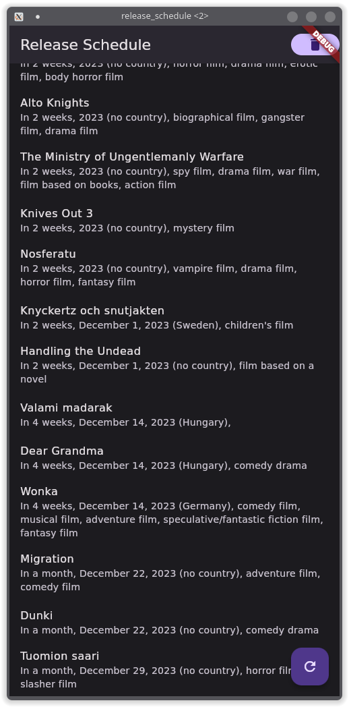

# Release Schedule

A small app using the Wikidata API to show upcoming movies.

You can try out the live web version at [daniel-michel.github.io/release_schedule](https://daniel-michel.github.io/release_schedule).

Android, Linux and Web builds can be found in the latest [CI run](https://github.com/daniel-michel/release_schedule/actions/workflows/ci.yml).

Currently, only a simple list of upcoming movies is shown:



The floating button at the bottom right can be used to load the upcoming movies and the button at the top right to clear the movies that where already loaded.


## Wikidata API

The Implementation can be found at [./lib/api/wikidata_movie_api.dart](./lib/api/wikidata_movie_api.dart).

To get information about the upcoming movies multiple APIs are used.

First the SPARQL API is used to retrieve upcoming movies using the endpoint "https://query.wikidata.org/sparql" with the following query:
```sql
SELECT
  ?movie
  (MIN(?releaseDate) as ?minReleaseDate)
WHERE {
  ?movie wdt:P31 wd:Q18011172;
         p:P577/psv:P577 [wikibase:timePrecision ?precision];
         wdt:P577 ?releaseDate.
  FILTER (xsd:date(?releaseDate) >= xsd:date("$date"^^xsd:dateTime))
  FILTER (?precision >= 10)
}
GROUP BY ?movie
ORDER BY ?minReleaseDate
LIMIT $limit
```
Where `$limit` is the maximum number of movies that are retrieved and `$date` the starting date from which movies are retrieved.
`$limit` is currently set to 100 and `$date` one week before the current one.
However, because there are multiple publication dates for most movies, the retrieved movies just need to have one publication date that is on or after `$date` for the movie to be included in the result. The `minReleaseDate` is not necessarily the release date displayed in the app, therefore some movies in the app might show up as having been released a long time ago.

The wd:Q18011172 is a "film project" these are films that are unpublished uor unfinished, but films that release soon are usually finished and might already be released in some countries and might instead be wd:Q11424 "film". Therefore the query is run for each of these categories.

To get additional information about the movies and all release dates (in case some are before `$date` and some after) the API endpoint "https://www.wikidata.org/w/api.php?action=wbgetentities" is used.
